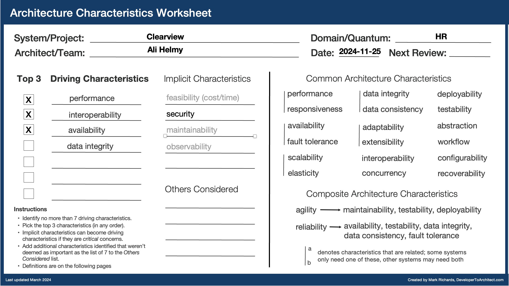

# Architecture Characteristics

## Characteristics
Architecture characteristics, often referred to as quality attributes (ilities) or non-functional requirements, define the properties of an architecture to meet the technical and business goals.
Choosen characteristics:
| | Description | Why |
|---|------------|-----|
| Performance | Quick response times for searches, matching, and profile management | Users expect responsive experience when searching candidates or applying for positions |
| Interoperability | Ability to integrate with external HR systems, job boards, and other platforms | Need to work seamlessly with existing employer systems and external data sources |
| Availability | System must be consistently available and perform matching operations accurately | Critical for maintaining trust of both employers and candidates in the platform's capabilities |
| Data Integrity | Ensuring accuracy and consistency of data throughout its lifecycle | Essential for maintaining anonymized profiles and preventing unauthorized PII exposure |
| Feasibility | The system must be feasible to implement and maintain | The platform needs to be flexible and adaptable to changing business requirements and technologies |
| Security | The system must protect sensitive user data, including PII, and ensure secure access control | Core requirement since the platform handles confidential candidate information that must be protected and only revealed at appropriate stages |

## Architectural Styles
Choosing service-based and event-driven architecture, to achieve the choosen quality attributes.
