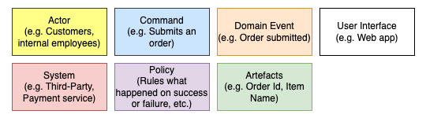
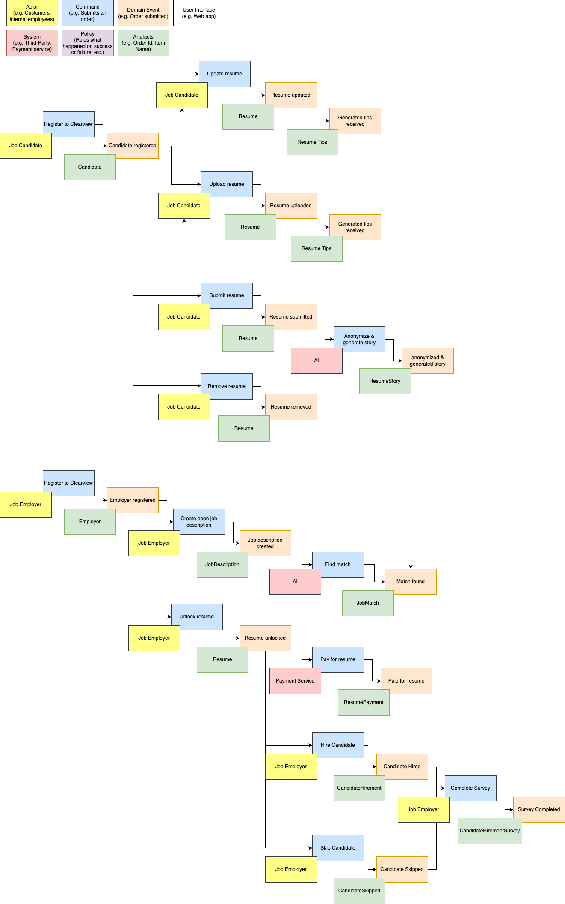
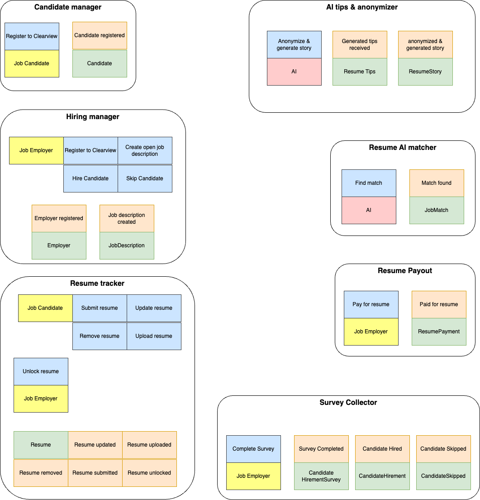

# Event Storming Workshop

## Introduction
Following the [ADR-001: Use Event Storming](../ADRs/ADR-001-use-event-storm.md), we will conduct an Event Storming workshop to understand the domain and build a shared understanding of the system.

## Map:
- **Actor**: Defined in yellow color.
- **System**: Defined in red color.
- **Command**: Defined in blue color.
- **Event**: Defined in orange color.

## Event storming:

## Components:
Grouping the events into components.
