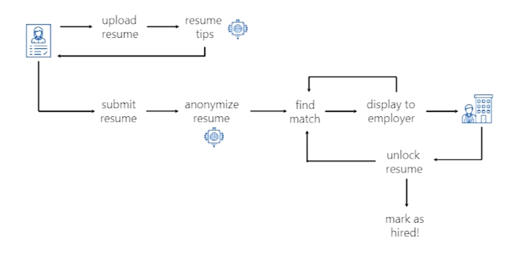
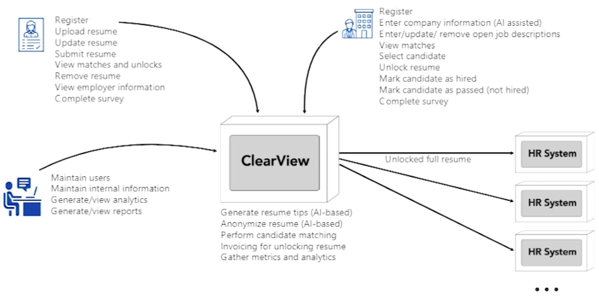

# arch-kata-clearview
Architecture Kata - Clearview - Self practice
Some words about the members and the group name.
## Members:
- Ali Helmy [LinkedIn](https://www.linkedin.com/in/ali-helmy-7aa52343/)

## Resources
- resource name

# Solution structure
Table of contents
- [Introduction](#introduction)
- [Event Storming](#event-storming)
- [Requirements](#requirements)
- [Architecture Characteristics](#architecture-characteristics)
- [Architecture Style](#architecture-style)
- [C4 Model](#c4-model)
- [Known limitations](#known-limitations)
- [Diagrams](#diagrams)

## Introduction
- **ClearView** is a supplemental **HR platform** that anonymizes candidate infomration while hightlighting objective skills and qualifying experience to reduce bias in the hiring process.
- It leverages **AI** to construct stories about a job candidate based on S.M.A.R.T (Specific, Measurable, Achievable, Relevant, Time-bound) goals, qualifications, and experience, that are then quantifiably aligend with open roles.
- All personal identifiable information (PII) and characteristics are eliminated until an objective determination is made on who the best candidate is to move forward with. The company pays to unlock the profile and data points are aggregated to reveal any disparties between those who are hired and those who were not selected.

### User Roles
- **Employer**: Companies invested in providing a more equitable experience to career seekers.
- **Job Candidate**: Professionals seeking a less tedious and more equitable hiring process that values their skills and abilities.
- **Administrator**: Management of the platform, registering users, providing data analytic reports on company performance and solution building services and executives.

### Primary Workflow

### Context Diagram and Use Cases

## Requirements
Detailed description [here](Requirements/requirements-and-assumptions.md)

## Event Storming
Following the [Event Storming](EventStorming/event_storming.md) workshop, we identified the key flows and interactions in the system. We chose Event Storming for this project because:

1. It enables rapid knowledge sharing between technical and business stakeholders
2. Helps identify key domain events, commands, and actors in the system
3. Naturally leads to identifying bounded contexts and potential microservices
4. Creates a shared understanding of the business workflow and requirements

Our Event Storming session revealed the key flows and interactions in the ClearView platform:

The Event Storming exercise helped us identify the major components and bounded contexts in the system, which informed our architectural decisions. Key insights included:

- The separation between candidate profile management and job matching processes
- The importance of the anonymization service as a core capability
- Natural boundaries between employer and candidate workflows
- Integration points with external systems like job boards and HR systems

## Architecture Characteristics
### Quality Attributes
Detailed description [here](ArchitectureCharacteristics/Characteristics.md)

### Architectural Styles
Detailed description [here](ArchitectureCharacteristics/Characteristics.md)

## C4 Model
Detailed description [here](C4/context.md)
